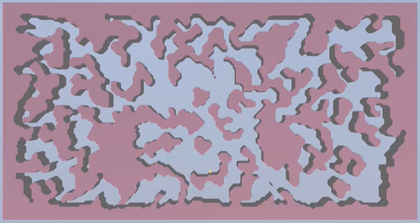
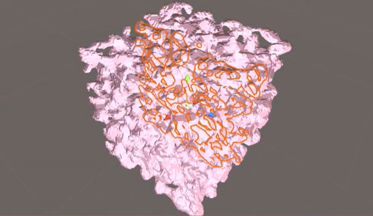

<b><h2>Procedural 2D and 3D caves</b></h2>

Youtube video available here: https://www.youtube.com/watch?v=3bV9xQNdMzo

This is a project where caves are procedurally generated in 2D and 3D.
The generation is based on a cellular automata:
- First, a random map is generated with empty spaces (0) and walls (1), and then smoothed depending on the amount of walls in a given zone.
- Then, the final empty spaces will form rooms. These rooms are then linked to one another, in a manner where each room is accessible.

In 2D, a mesh and a collider are then created with a <b>Marching Squares</b> algorithm.

In 3D, the <b>Marching Cubes</b> algorithm is used. In this project, the faces are inverted so that the player explores the inside of the caves. The mesh is also separated in several pieces, in order not to reach Unity's mesh vertice limit.

<b>Controls:</b>
- Right click in game to generate a new cave with the given editor parameters (warning, in 3D the delay can be long if the map is too large)
- Use ZQSD and Space to move the yellow cube in 2D, or to move the first person controller in 3D

